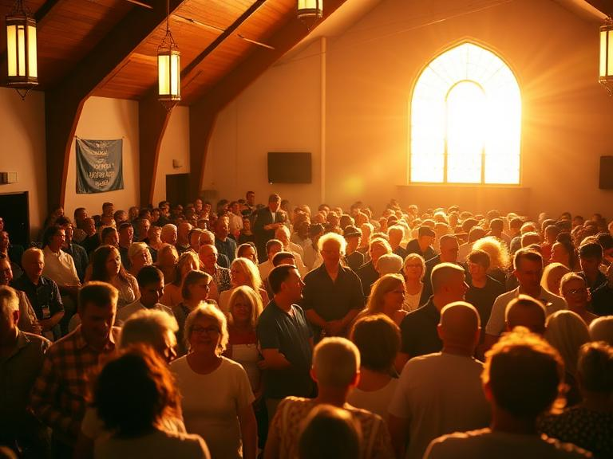
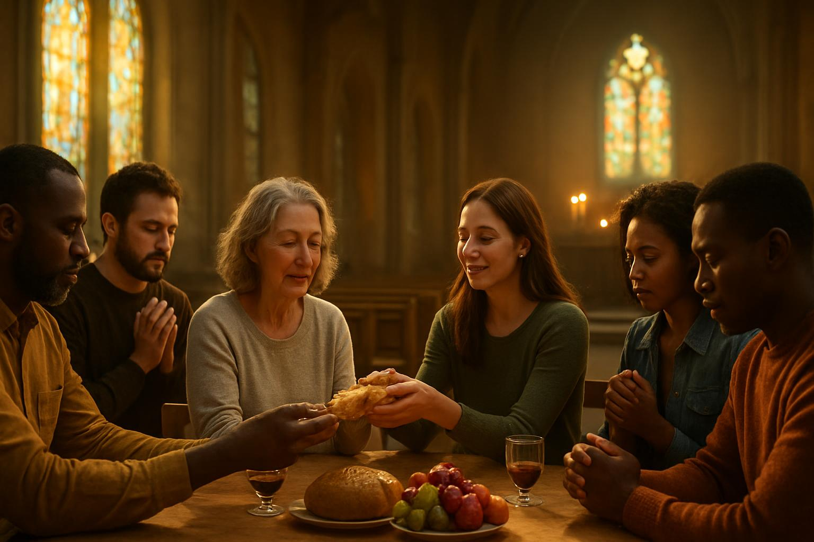
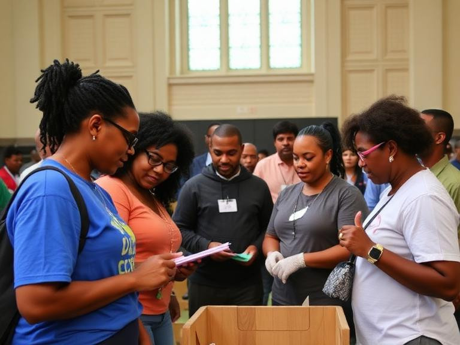
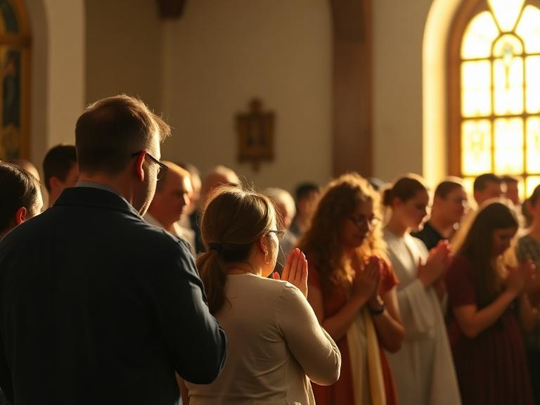

# Comunidade

---

# Mudanças

---

# Apoio

---

## O Chamado
**Hebreus 10:24-25**; **Romanos 12:4-5**  

**Chamado Divino** - viver em comunidade como mandamento **essencial**.
**Incentivo Mútuo** - comunhão inspira **amor** e boas obras.
**Preparação para o Futuro** - Crescimento juntos para o **retorno de Cristo**.  

---

## Benefícios
**Atos 2:42-47**; **1 Coríntios 12:25-27**

**Crescimento Espiritual** - ensino, comunhão, oração, partilha.
**Testemunho Poderoso** - unidade que atrai novos crentes.
**Cuidado Mútuo** - partes do mesmo corpo que se apoiam.   

---

## Juntos
**Eclesiastes 4:9-12**; **Gálatas 6:2**

**Força na Unidade** - dois são melhores que um.
**Apoio Mútuo** - carregar fardos uns dos outros.  

---

# Reflexão
**Colossenses 3:16**

A comunidade cristã é presente **divino**; somos chamados a caminhar **lado a lado** como pássaros em 'V'.

---

# Ação
**Efésios 4:2-3**

Renove o **compromisso** com a comunidade neste ano: humildade, paciência, amor, preservar a unidade. 

---

