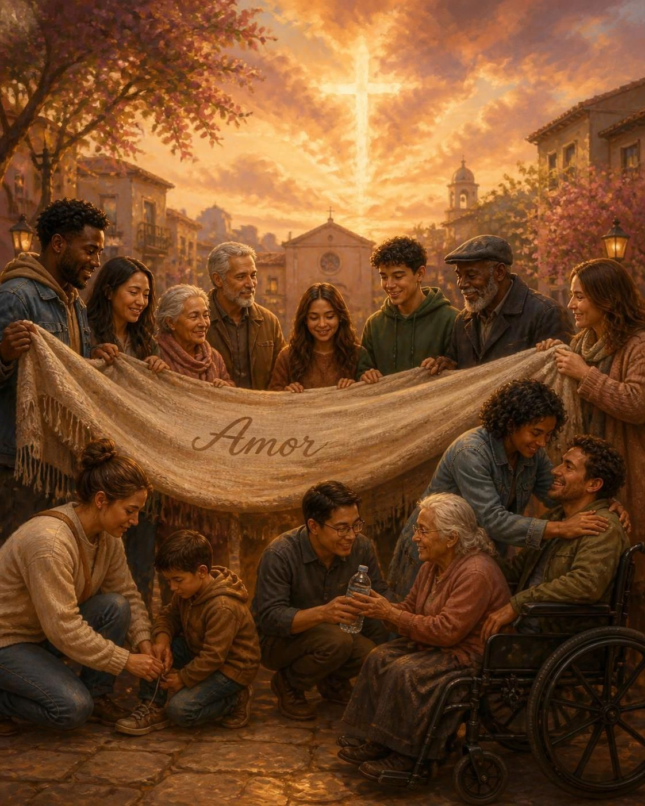

# O Amor Divino

"Deus é amor."
1 João 4:8

---

# Introdução

O Dia dos Namorados nos convida a refletir sobre o **amor que transforma e sustenta**.

O amor descreve o **caráter imutável de Deus**.

Mateus 22:37-40

---

# Deus é Amor

**1 João 4:8** – "Deus é amor."
**Jeremias 31:3** – "Com amor eterno te amei"
**Romanos 5:8** – Cristo morreu por nós

O amor divino é **eterno**, **incondicional** e **sacrificial**.

---

# Características do Amor

**1 Coríntios 13**

Paciência e longanimidade – **Êxodo 34:6**
Bondade e misericórdia – **Salmo 145:9**
Humildade e serviço – **Filipenses 2:7-8**
Perdão e graça – **Efésios 4:32**

---

# Aplicando o Amor Divino

**No casamento/namoro** – comunicação paciente, humildade
**Na família** – perdão generoso, amor sacrificial
**Na comunidade** – hospitalidade, serviço voluntário

"Acima de tudo, revesti-vos de amor, que é o vínculo da perfeição."
Colossenses 3:14

---

# Conclusão

O amor de Deus se manifesta nas **qualidades de 1 Coríntios 13**.

Ao viver essas virtudes, somos **espelhos do caráter divino**.

Busque diariamente a presença de Deus para que Seu amor transforme cada relacionamento.

