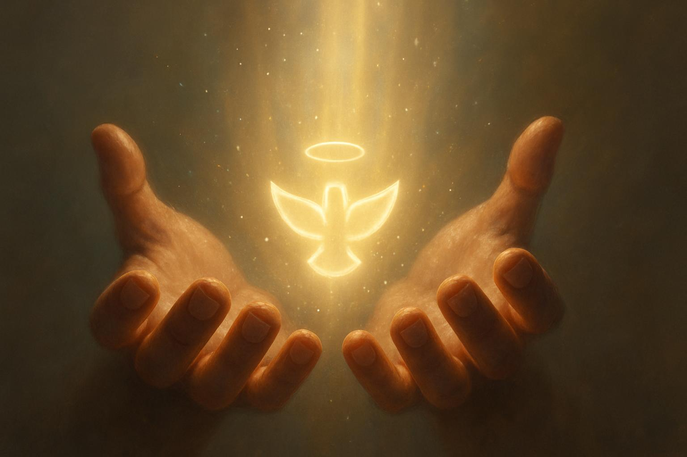
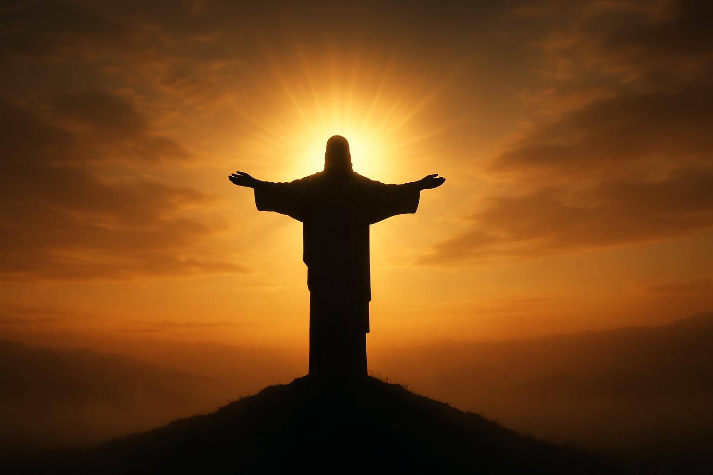
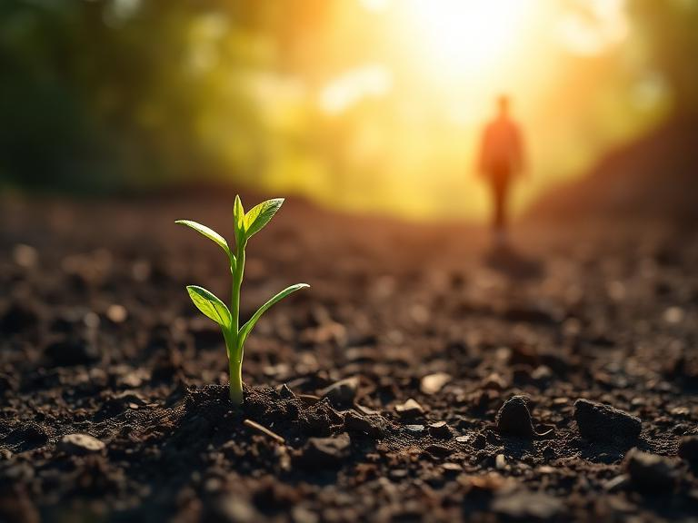
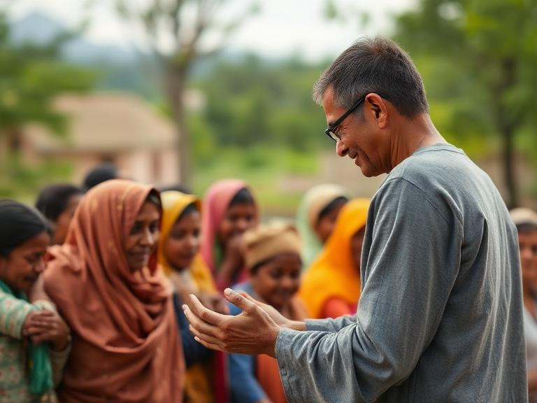
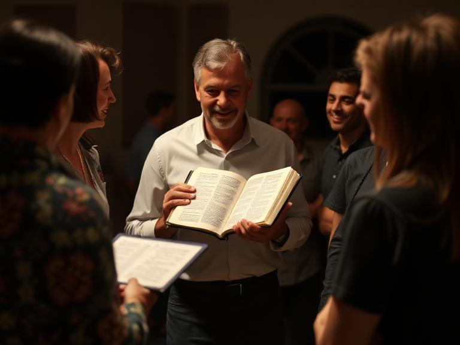
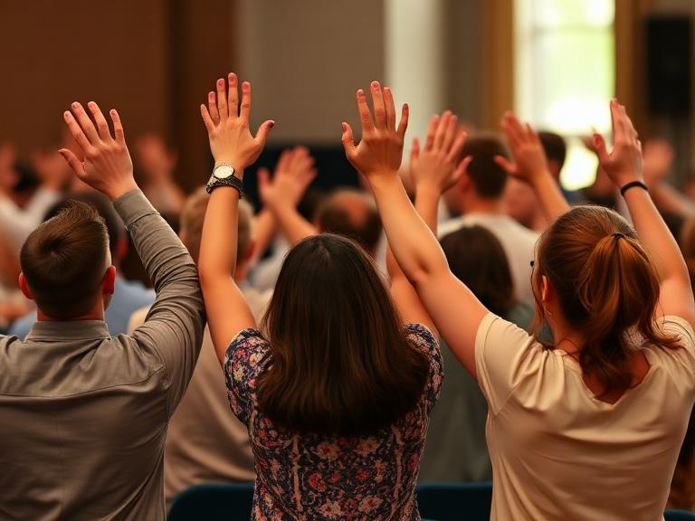

# O Maior Presente  

---
# João 3:16

---
## Propósito
**Reconhecer** o presente de Jesus
Ser **grato** pela salvação  
Tornar isso **central** na vida

---
## O Presente
Jesus = Filho de Deus  
Não é um **presente** comum  
Motivação: **Romanos 5:8**

---
## Impacto
**Redenção** dos pecados - **Efésios 1:7**  
**Perdão** alcançável em Cristo

---
## Resultado
**Transformação** real - 2 Cor. 5:17  
Vida **renovada** em Cristo

---
## Gratidão
Práticas que **honram** o presente  
**Col. 3:17**

---

## Ação
Fazer **discípulos** - **Mateus 28:19-20**  
**Testemunho** prático e verbal

---

**Jesus** = maior presente  
Nossa **vida** como expressão de **gratidão**

---

## Reflexão
Como você **respondeu** ao presente?  
Renove seu **compromisso** com Cristo hoje

