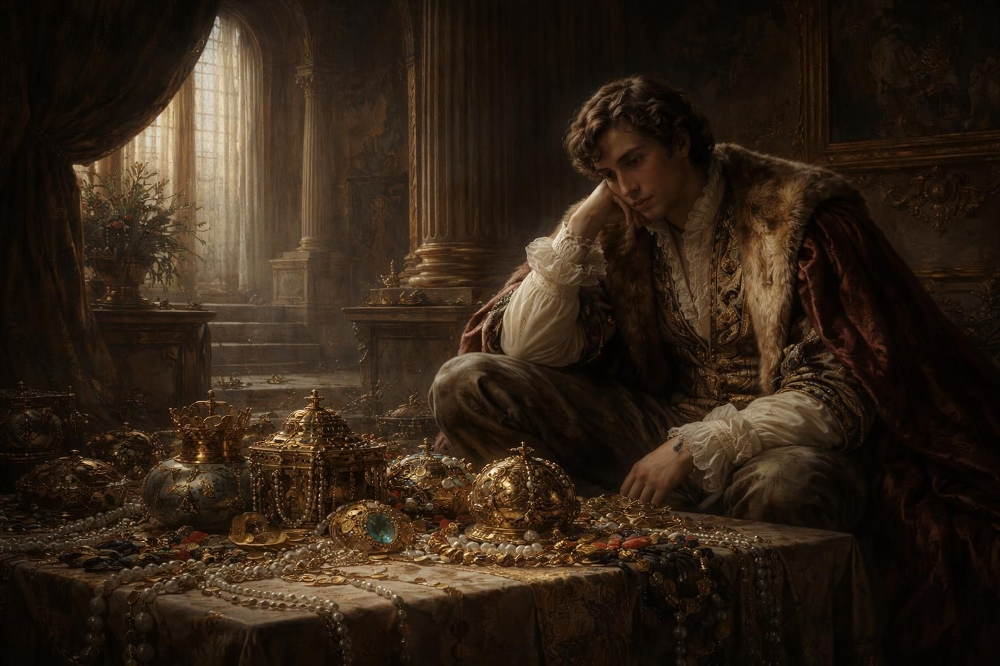
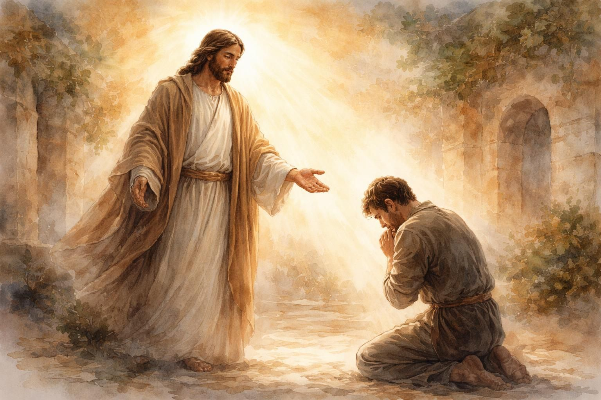
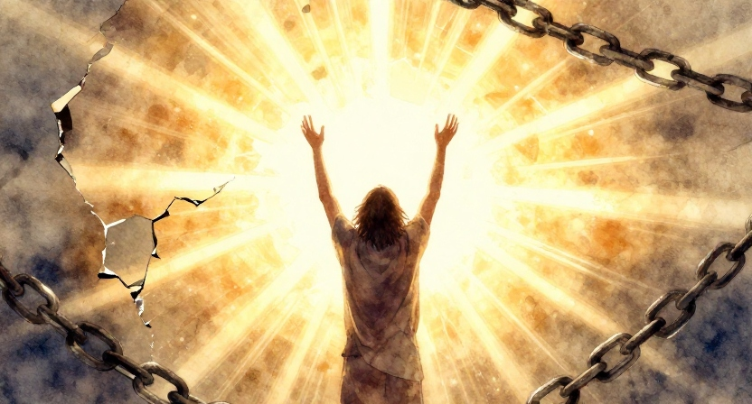
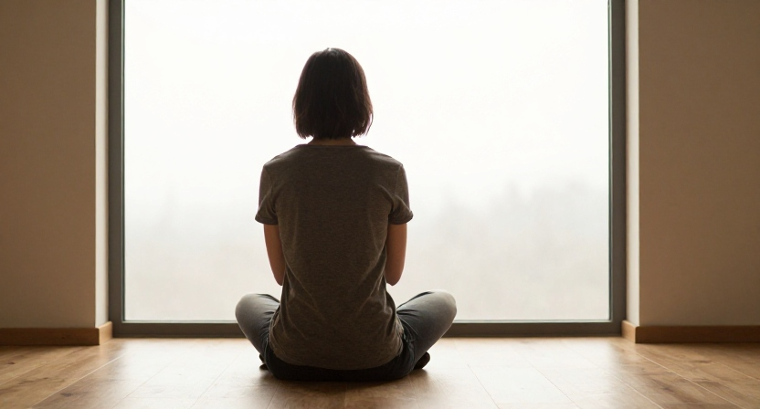

# Quando Tudo Ainda é Pouco

"Se alguém quer vir após Mim, negue a si mesmo,
tome a sua cruz e siga-Me."
Marcos 8:34

---

# O Jovem Rico e Seu Vazio

Disse-lhe o jovem: &quot;A tudo isso tenho obedecido. O que me falta ainda?&quot;
Mateus 19:20

---

# O Jovem Rico e Seu Vazio

Ele tinha tudo: riqueza, respeito, religiosidade. Mas seu coração carregava um vazio. "O que me falta ainda?"

---

# A Resposta de Jesus
Ao ouvir isso, disse-lhe Jesus: &quot;Falta-lhe ainda uma coisa. Venda tudo o que você possui e dê o dinheiro aos pobres, e você terá um tesouro nos céus. Depois venha e siga-me&quot;.
Lucas 18:22

---

# A Resposta de Jesus

"Uma coisa ainda falta a você." Não era mais uma regra, mas rendição total. Jesus queria tudo, não apenas parte.

---

# Admiradores, Não Seguidores

Queremos salvação sem o custo do discipulado. Desejamos o Céu, mas relutamos em deixar o trono do nosso próprio coração.

---

# O Preço da Verdadeira Libertação

Jesus não pede para dar um pouco; Ele pede tudo. Não porque quer privar, mas porque deseja nos libertar.

---

# Negar a Si Mesmo

Seguir Jesus é uma escolha diária. É deixar aquilo que ocupa o lugar de Deus e confiar que Ele nos ama demais para nos deixar presos.

---

# A Transformação Possível

"Mediante o poder de Cristo, homens e mulheres têm quebrado as correntes do hábito pecaminoso. Têm renunciado ao egoísmo." — Ellen White, Atos dos Apóstolos, p. 302

---

# Reflita e Responda

O que ainda está entre mim e Jesus? O que Ele me pede que eu ainda resisto em entregar?

