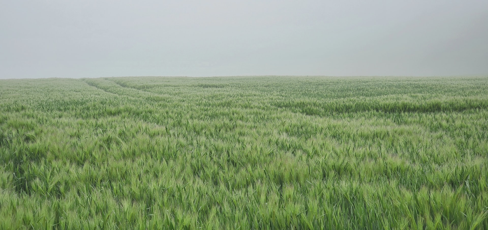
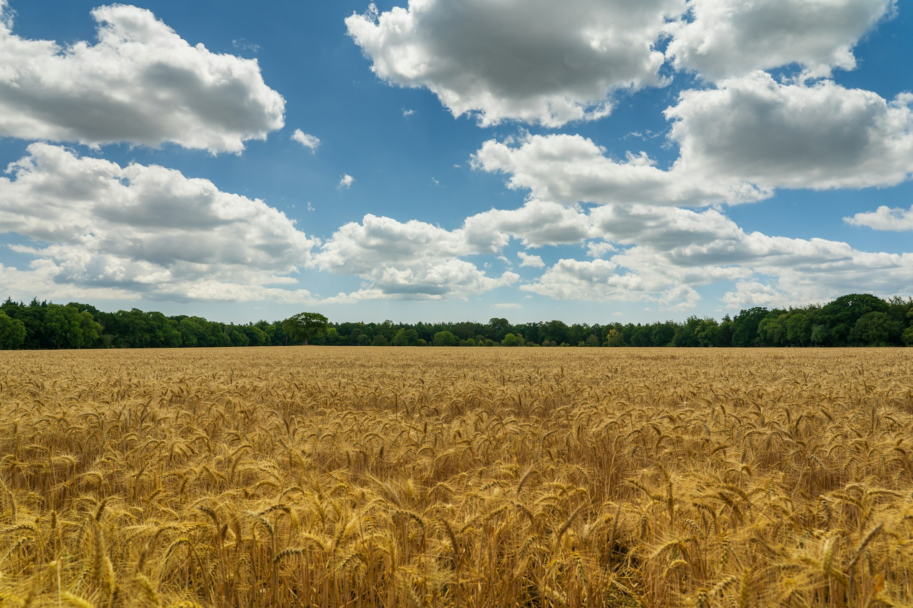
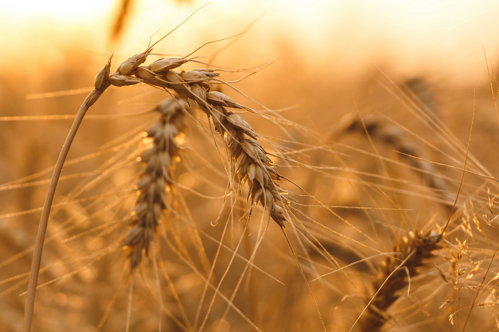
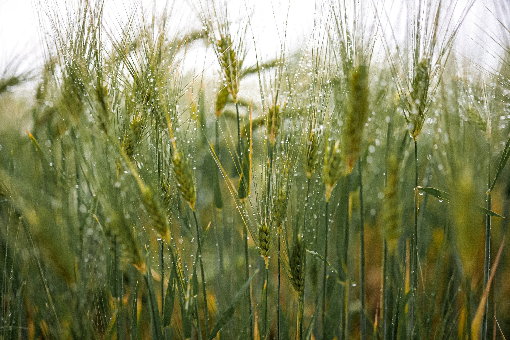

<!-- slide-id: baf102cb-0ba0-4ff3-80ae-5a82f0f91f6d -->

# A Promessa da Chuva Tardia

## O Espírito Santo e a Colheita Final

<!--
Texto-base: Joel 2:23-29; Oséias 6:3
-->

---

<!-- slide-id: 8a1b3c4d-5e6f-4a7b-8c9d-0e1f2a3b4c5d -->

## Introdução

- O agricultor de Israel conhecia duas chuvas essenciais
- **Temporã** - cai no outono e faz a semente germinar
- **Serôdia** - cai na primavera e amadurece o grão
- Sem a temporã, não há broto; sem a serôdia, não há colheita
- A vida espiritual segue a mesma lógica

<!--
Tiago 5:7 - O lavrador espera a primeira e a última chuva
-->

---

<!-- slide-id: 1c2d3e4f-5a6b-4c7d-8e9f-0a1b2c3d4e5f -->

# A Chuva Temporã
## O Pentecostes e a Germinação

<!--
Joel 2:23 - A promessa das chuvas
-->

---

<!-- slide-id: 2d3e4f5a-6b7c-4d8e-9f0a-1b2c3d4e5f6a -->

## Pentecostes: A Primeira Chuva

- Joel 2:23 - Deus promete a temporã e a serôdia
- Atos 2:1-4 - O Espírito desceu sobre os 120
- Atos 2:41 - Três mil almas convertidas
- A semente do evangelho começou a germinar
- A temporã produz conversão

<!-- _footer: Atos 2:1-4; Joel 2:23 -->

---

<!-- slide-id: 3e4f5a6b-7c8d-4e9f-0a1b-2c3d4e5f6a7b -->

# A Chuva Serôdia
## A Promessa para os Últimos Dias

<!--
Oséias 6:3 - Ele virá como a chuva serôdia
-->

---

<!-- slide-id: 4f5a6b7c-8d9e-4f0a-1b2c-3d4e5f6a7b8c -->

## O Que é a Chuva Serôdia

- Oséias 6:3 - Como a serôdia que rega a terra
- Amadurece o grão para a colheita final
- Prepara a igreja para a vinda de Jesus
- Zacarias 10:1 - Devemos pedir a chuva serôdia
- Será mais abundante que o Pentecostes

<!-- _footer: Oséias 6:3; Zacarias 10:1; Tiago 5:7-8 -->

---

<!-- slide-id: 5a6b7c8d-9e0f-4a1b-2c3d-4e5f6a7b8c9d -->

## A Obra Final do Espírito

- O evangelho terminará com grande poder
- A chuva serôdia dará poder à mensagem dos três anjos
- O "alto clamor" iluminará a Terra com a glória de Deus
- Preparará os santos para o tempo de angústia
- Apocalipse 14:6-12 - A proclamação final

<!-- _footer: Apocalipse 14:6-12 -->

---

<!-- slide-id: 6b7c8d9e-0f1a-4b2c-3d4e-5f6a7b8c9d0e -->

# A Condição
## Manter o Vaso Limpo

<!--
Atos 3:19 - Tempos de refrigério da presença do Senhor
-->

---

<!-- slide-id: 7c8d9e0f-1a2b-4c3d-4e5f-6a7b8c9d0e1f -->

## A Serôdia Não Corrige Erros

- Joel 2:12-13 - Rasgai o coração, não as vestes
- A serôdia amadurece - não produz o que faltou
- Sem a temporã, a serôdia é ineficaz
- 2 Coríntios 7:1 - Purificai-vos de toda contaminação
- Atos 3:19 - Arrependimento precede o refrigério

<!-- _footer: Joel 2:12-13; 2 Coríntios 7:1; Atos 3:19 -->

---

<!-- slide-id: 8d9e0f1a-2b3c-4d4e-5f6a-7b8c9d0e1f2a -->

# Reavivamento e Reforma
## A Obra que Precede a Chuva

<!--
Salmo 51:10-12 - Cria em mim um coração puro
-->

---

<!-- slide-id: 9e0f1a2b-3c4d-4e5f-6a7b-8c9d0e1f2a3b -->

## Preparando o Caminho

- Reavivamento primeiro, chuva depois
- Salmo 51:10 - Oração por um coração puro
- Isaías 44:3 - Derramarei água sobre o sedento
- Confissão, abandono do pecado, fervorosa oração
- Igrejas vivas e atuantes recebem o Espírito

<!-- _footer: Salmo 51:10-12; Isaías 44:3 -->

---

<!-- slide-id: 0f1a2b3c-4d5e-4f6a-7b8c-9d0e1f2a3b4c -->

# Aplicação para Hoje
## Prepare o Seu Vaso

<!--
Oração: "Que a chuva serôdia caia em meu vaso"
-->

---

<!-- slide-id: 1a2b3c4d-5e6f-4a7b-8c9d-0e1f2a3b4c5d -->

## Como se Preparar

- Confesse e abandone o pecado conhecido
- Cultive oração e estudo da Palavra
- Ore pela chuva: "Pedi ao Senhor chuva"
- Sirva hoje - não espere o derramamento
- Compartilhe a esperança com alguém

<!-- _footer: Zacarias 10:1 - Pedi ao Senhor chuva no tempo da chuva serôdia -->

---

<!-- slide-id: 2b3c4d5e-6f7a-4b8c-9d0e-1f2a3b4c5d6e -->

# Conclusão
## Qual Será a Sua Resposta?

<!--
A promessa virá - o vaso estará pronto?
-->

---

<!-- slide-id: 3c4d5e6f-7a8b-4c9d-0e1f-2a3b4c5d6e7f -->

# "Pedi ao Senhor chuva no tempo da chuva serôdia"

## Zacarias 10:1

<!--
Apelo: Prepare o vaso hoje - peça a chuva e aja como se ela já estivesse caindo. Tiago 5:8 - "A vinda do Senhor está próxima"
-->
