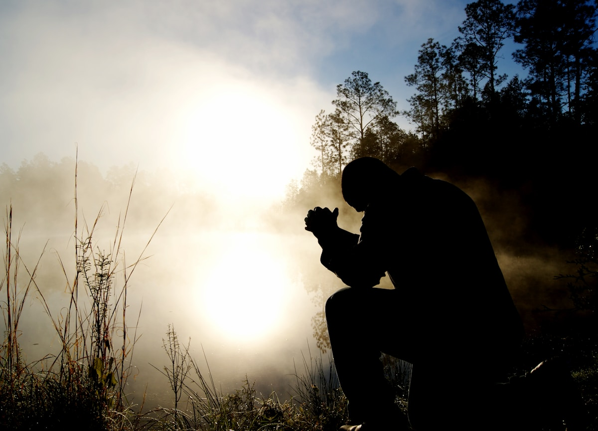
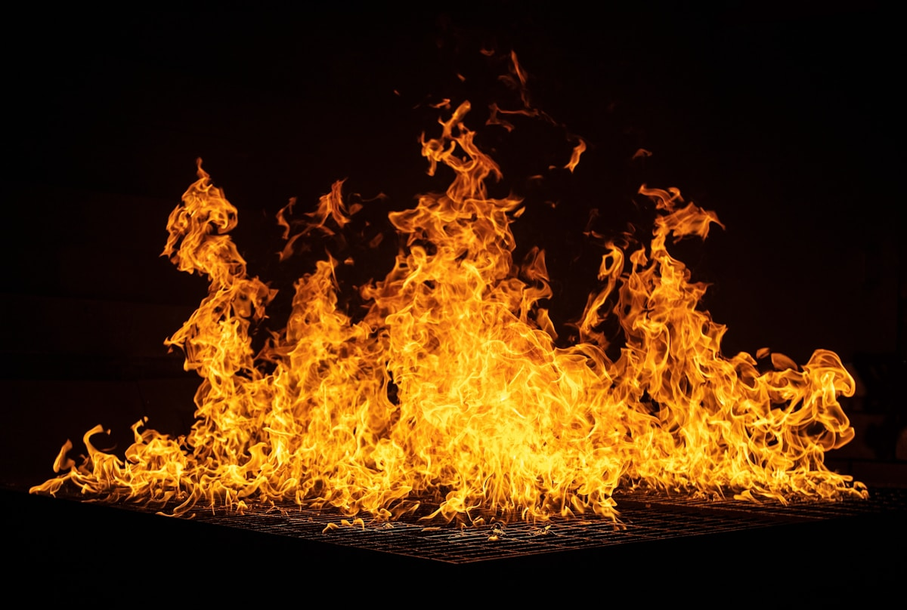
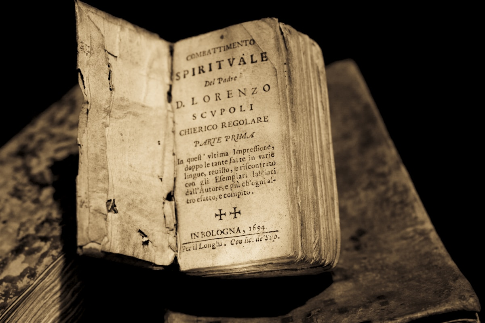
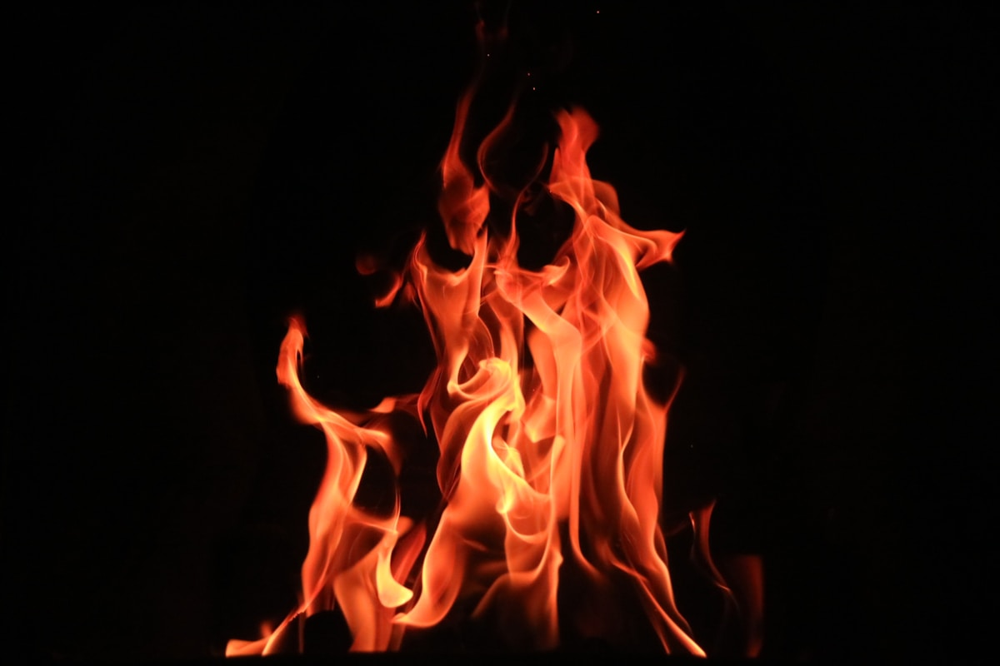
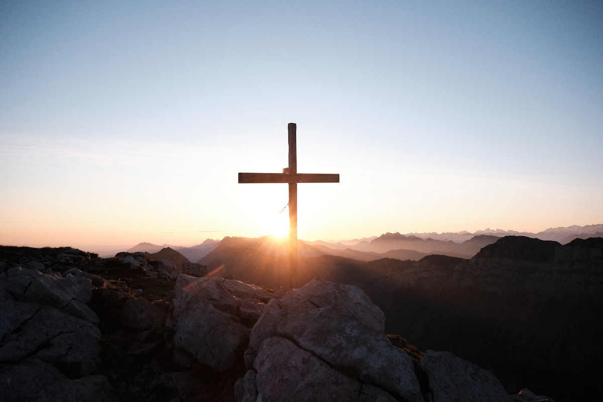
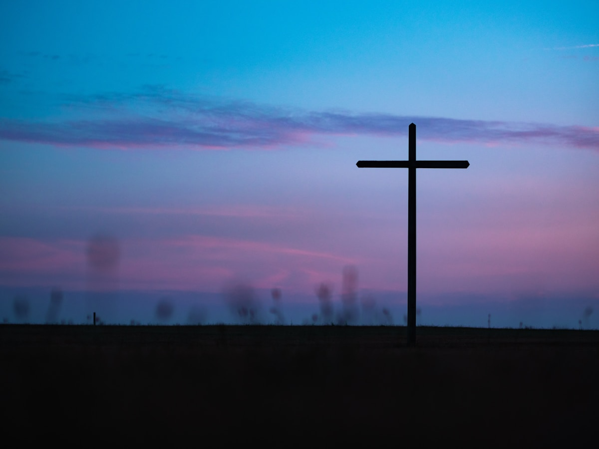

<!-- slide-id: b24736e2-e687-42b6-bc26-f7474648d7cb -->

# O Fogo que Desce do Céu

<!--
Texto-base: 1 Reis 18:20-40
-->

---

<!-- slide-id: 54eb1a38-556b-410d-b7c9-2e420baecd4c -->

## Introdução

- Uma nação inteira se desviou de Deus
- O rei Acabe e a rainha Jezabel promoviam a idolatria
- 450 profetas falsos sustentados pelo palácio
- Em meio à escuridão espiritual, um homem ousou se levantar: **Elias**

<!--
1 Reis 18:20-40
-->

---

<!-- slide-id: 63114d74-bd25-4134-b356-2bdbd5923b87 -->

# O Chamado à Decisão
## Até quando coxearão entre dois pensamentos?

<!--
1 Reis 18:21 - A palavra hebraica para "oscilar" é a mesma para "dançavam"
-->

---

<!-- slide-id: 7e5df6f4-8cb5-4cfb-b8bd-2ba330d5ca1d -->

## A Indecisão de Israel

- Tentavam servir Deus e a Baal ao mesmo tempo
- Mateus 6:24 - Ninguém pode servir a dois senhores
- Apocalipse 3:15-16 - O perigo da mornidão
- A neutralidade espiritual é uma ilusão perigosa
- Deus não aceita divisão de lealdade

<!-- _footer: 1 Reis 18:21; Mateus 6:24; Apocalipse 3:15-16 -->

---

<!-- slide-id: 87ba2ff8-de28-46d2-b976-b470b9e3cd49 -->

# A Impotência dos Ídolos
## Um Deus que Não Responde

<!--
1 Reis 18:26-29 - Os profetas de Baal clamaram sem resposta
-->

---

<!-- slide-id: 001cf831-be8f-487d-a98b-b0aeea3fd976 -->

## Os Profetas de Baal

- Dançavam, gritavam, feriam-se com espadas
- Clamaram desde a manhã até a tarde
- Nada acontecia - seu deus era mudo e surdo
- Elias zombou: talvez esteja dormindo
- Os ídolos modernos também são impotentes

<!-- _footer: 1 Reis 18:26-29; Salmo 115:4-8 -->

---

<!-- slide-id: 6f8bdb8c-83aa-4374-8dec-2dd4d165d43b -->

# A Restauração do Altar
## Preparando o Caminho para Deus

<!--
1 Reis 18:30-35 - Elias reconstruiu o altar com 12 pedras
-->

---

<!-- slide-id: 3221fbf4-e3c0-4526-97ed-18113f34cfad -->

## O Altar Reconstruído

- 12 pedras - uma para cada tribo de Israel
- Lembrava a unidade do povo diante de Deus
- Representava restauração e arrependimento
- Quatro cântaros de água derramados três vezes
- Tornou o impossível ainda mais impossível

<!-- _footer: 1 Reis 18:30-35; João 15:5 -->

---

<!-- slide-id: 64c67855-9a80-4e5f-b82e-792e27e186e6 -->

# A Oração de Fé
## Simplicidade que Move o Céu

<!--
1 Reis 18:36-37 - Uma oração breve, humilde e centrada em Deus
-->

---

<!-- slide-id: 6e4306b6-1eae-4e2c-b4ff-1a81287efc8e -->

## O Contraste das Orações

- Profetas de Baal: horas de gritos frenéticos
- Elias: oração breve, humilde e direta
- Não há espetáculo, apenas fé
- Tiago 5:16-18 - A oração do justo é eficaz
- A eficácia está na fé, não em palavras bonitas

<!-- _footer: 1 Reis 18:36-37; Tiago 5:16-18; 1 João 5:14-15 -->

---

<!-- slide-id: c526ce3f-1b48-4fb6-a982-33ad249cd1f4 -->

# O Fogo do Céu
## A Resposta que Silencia Todos

<!--
1 Reis 18:38-39 - O fogo consumiu tudo, inclusive a água
-->

---

<!-- slide-id: 6f7f19c6-5b55-4a14-a71d-89a619ccd9c4 -->

## A Resposta de Deus

- O fogo consumiu sacrifício, lenha, pedras e água
- Deus não deixa dúvidas quando age
- O povo caiu com o rosto em terra
- "Só o Senhor é Deus!"
- Conexão com o Grande Conflito - os dias finais

<!-- _footer: 1 Reis 18:38-39; 2 Crônicas 7:1-3 -->

---

<!-- slide-id: d8aa73b6-6ec7-4ada-89d6-1646a8ed22f4 -->

# Aplicação para Hoje
## Lições para a Nossa Vida

---

<!-- slide-id: 1aa95477-2064-47e4-9aaa-24f9c80e653c -->

## Identifique os Ídolos

- O que ocupa o lugar de Deus em seu coração?
- Sucesso profissional?
- Aprovação social?
- Conforto material?
- Deus não compartilha Sua glória

<!-- _footer: Tiago 5:17 - Elias era homem como nós -->

---

<!-- slide-id: c5354edf-1725-4de5-bce7-0a8e29cc316c -->

## Seja Corajoso

- Elias era homem como nós, mas ousou se levantar
- Conagem não é ausência de medo
- Agir apesar do medo, confiando em Deus
- Restaure o altar em sua vida
- Ore com fé - o mesmo Deus responde hoje

<!-- _footer: Josué 24:15 - Eu e minha casa serviremos ao Senhor -->

---

<!-- slide-id: bd5f5b63-b96a-4284-9ac0-6cc40ad2d66d -->

# Conclusão
## Qual será a sua escolha?

---

<!-- slide-id: 204b6893-d68b-4dc4-95fb-5a77b60a8ff3 -->

# "Só o Senhor é Deus!"

Hoje é o dia de declarar
como Israel no Carmelo

<!--
Apelo: Que possamos dizer, como Josué: "Eu e minha casa serviremos ao Senhor" (Josué 24:15)
-->
