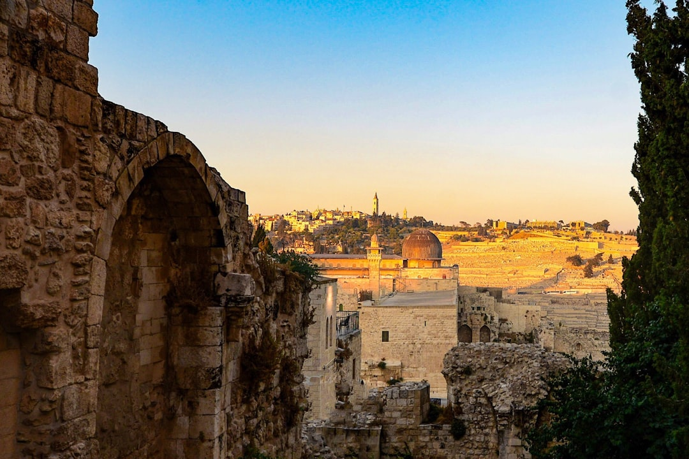
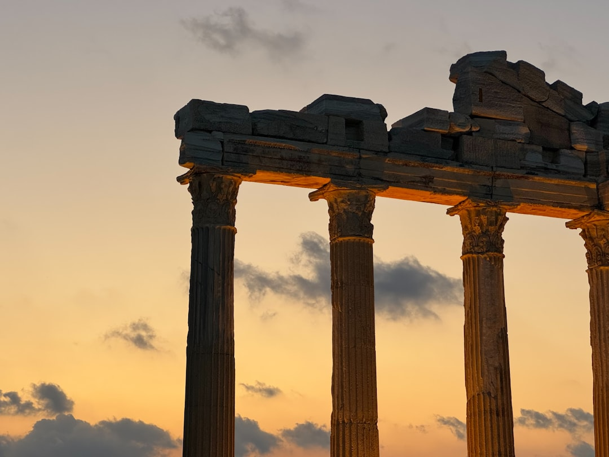
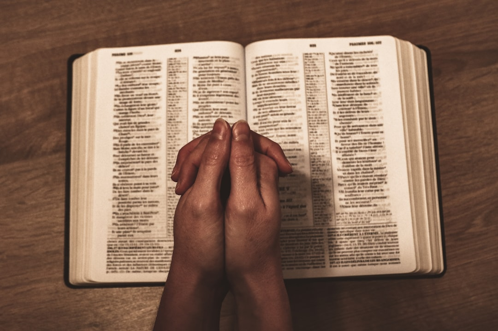
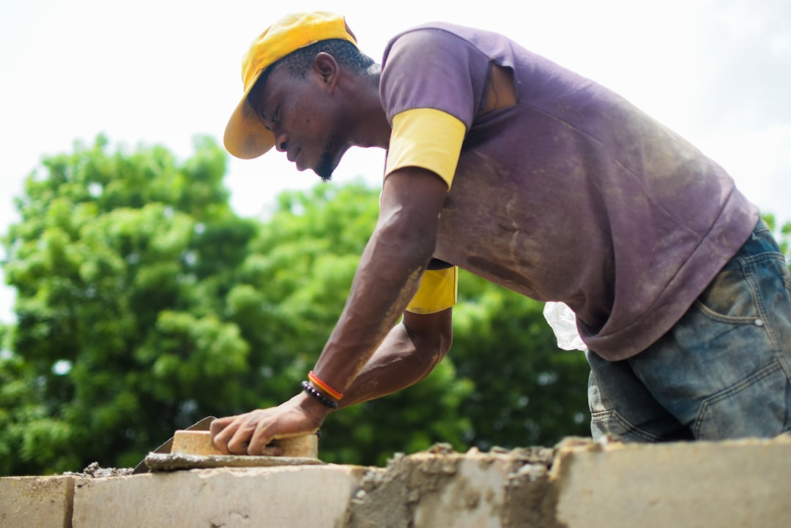
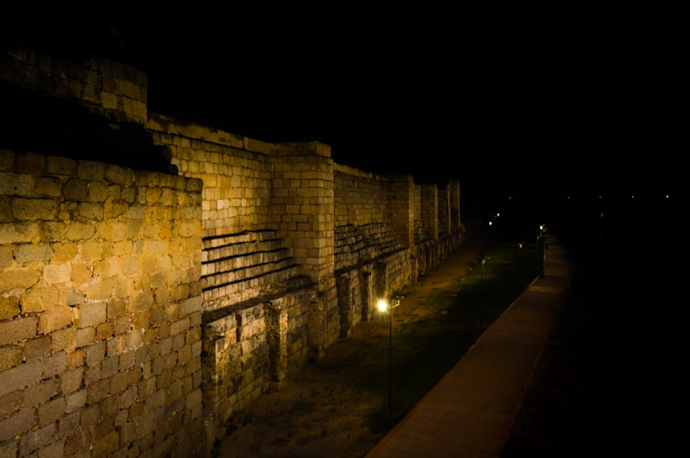
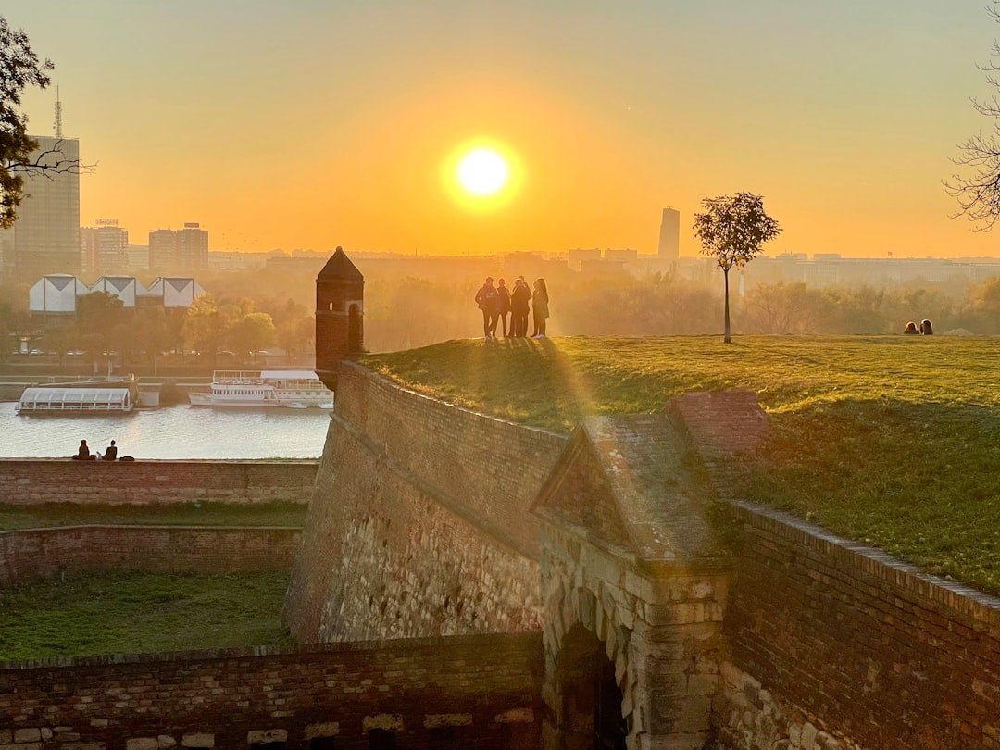

<!-- slide-id: 6f2d9c41-2ab7-4e5a-9c3d-1a8b4f7e0c2a -->

# Levanta-te e Edifiquemos

## A Coragem de Reconstruir os Muros

<!--
Texto-base: Neemias 1:1-4; 2:17-18; 4:6; 6:15-16
-->

---

<!-- slide-id: 3b8c5e71-94d0-4f16-8a2e-5d0f9b6a3c71 -->

## Introdução

- Jerusalém em ruínas — muros derrubados, portas queimadas
- O povo vivia desprotegido, humilhado e envergonhado
- Neemias, copeiro do rei, vivia no conforto do palácio de Susã
- Ao ouvir a notícia, seu coração se partiu

<!--
Neemias 1:1-4
-->

---

<!-- slide-id: 9d4e2f8a-1b37-4c8d-9f6e-3a0c7b5d8e42 -->

# Um Coração Quebrantado

## A Reconstrução Começa Antes da Obra

<!--
Neemias 1:3-4 - Neemias chorou, jejuou e orou por dias
-->

---

<!-- slide-id: 5a7e3c92-d4f1-4b6a-8c3e-2f0d9a6e1b75 -->

## Sensibilidade e Oração

- Neemias deixou a dor alcançar o coração
- Abandonou a comodidade do palácio por amor ao povo
- Chorou, jejuou e confessou os pecados de Israel
- Orou antes de agir — dependência total de Deus
- Toda reconstrução começa no altar

<!-- _footer: Neemias 1:3-4; Salmo 51:17; Mateus 9:36 -->

---

<!-- slide-id: c8b1f4d6-2e9a-4b7c-9d5a-6e3f0a1b2c84 -->

# A Visão que Transforma

## Inspecionar para Reconstruir com Propósito

<!--
Neemias 2:11-18 - A inspeção noturna dos muros
-->

---

<!-- slide-id: 7e2f0b5a-3c8d-4a1e-8b6f-9d4c2a7e5f13 -->

## Visão, Oração e Ação

- De noite, Neemias inspecionou cada brecha e porta queimada
- Conheceu a realidade antes de convocar o povo
- "Vinde e reedifiquemos o muro de Jerusalém" (Ne 2:17)
- "Levantemo-nos e edifiquemos" — a resposta unânime
- Visão mobiliza: informação real + convicção divina

<!-- _footer: Neemias 2:11-18; Provérbios 27:23 -->

---

<!-- slide-id: 2a6d4c8f-5b1e-4a79-8c3d-0e9f2a6b4d81 -->

# Unidade no Trabalho

## Cada Um Diante da Sua Porta

<!--
Neemias 3:1-32 - Cada família reconstruiu o trecho em frente à sua casa
-->

---

<!-- slide-id: b4e9c2f1-6d3a-4e5b-9c7f-8a1d0b3e5c26 -->

## A Igreja em Construção

- Sacerdotes, ourives, perfumistas, comerciantes e mulheres
- Ninguém grande demais, ninguém pequeno demais
- Cada um trabalhou "em frente à sua casa"
- "O coração do povo se inclinava a trabalhar" (Ne 4:6)
- A reconstrução é coletiva — cada um tem seu trecho

<!-- _footer: Neemias 3:1-32; 4:6; 1 Coríntios 12:12-27 -->

---

<!-- slide-id: 1d5b7e3a-8c2f-4d6e-9a1b-0e4c8f2a6d93 -->

# A Oposição e a Perseverança

## Trabalhando com a Espada na Mão

<!--
Neemias 4:1-23; 6:1-3 - Sambalate, Tobias e Gesém
-->

---

<!-- slide-id: 8f3a1c5e-4b7d-4e9a-8c2f-6d0b1a7e3c54 -->

## As Quatro Frentes de Ataque

- Sambalate zombou: "a raposa derrubará"
- Tobias ridicularizou a obra
- Gesém espalhou calúnias
- Tramaram emboscada no vale de Ono
- A resposta de Neemias: orar, vigiar e continuar

<!-- _footer: Neemias 4:1-8; 4:17-18; 6:3 -->

---

<!-- slide-id: 3e6a2d8b-9f4c-4a1e-8b5d-7c0f2a9e1b64 -->

# A Obra Concluída

## 52 Dias de Glória

<!--
Neemias 6:15-16 - O muro foi terminado em 52 dias
-->

---

<!-- slide-id: a9c4f2d6-5e3b-4a7c-9d1e-0b8f3a6c2e75 -->

## O que Parecia Impossível

- O muro concluído em 52 dias
- Até os inimigos reconheceram: "Deus fez esta obra"
- "Reparadores das roturas, restauradores de veredas"
- A obra de Neemias é símbolo de uma restauração maior
- Aponta para a Nova Jerusalém — a proteção de Deus

<!-- _footer: Neemias 6:15-16; Isaías 58:12; Apocalipse 21:9-27 -->

---

<!-- slide-id: 6b1e4a9c-2f7d-4e3a-8c5b-1d0a7e9f3c82 -->

# Aplicação para Hoje

## Reconstruindo Nossas Ruínas

---

<!-- slide-id: d4a8f2c6-7b3e-4e9a-9c1d-5f0e2a6b8c34 -->

## Onde Estão os Seus Muros?

- Sinta a dor de Deus pela obra — não ignore as ruínas
- Inspecione antes de construir — avalie com honestidade
- Trabalhe diante da sua porta — lar, família, vizinhança
- Persevere sob a oposição — não desça ao vale de Ono
- Colher do trabalho numa mão, espada da Palavra na outra

<!-- _footer: Neemias 4:17-18; 6:3 -->

---

<!-- slide-id: f2e8c4b1-3a6d-4e9f-8b7c-0d1a5e2f9c63 -->

# Conclusão

## Deus Especialista em Reconstruir

---

<!-- slide-id: 5c3a9d7e-1b4f-4a6c-8e2d-9f0b3a6c1e85 -->

# "Levantemo-nos e Edifiquemos!"

Hoje é o dia de responder,
como o povo de Neemias

<!--
Apelo: Qual é o trecho do muro diante da sua porta? Levante-se, ore, trabalhe e confie — Deus completará a obra que começou.
-->
