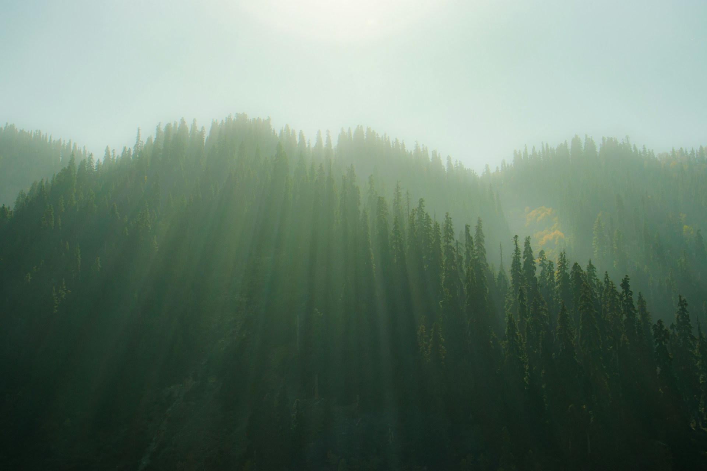
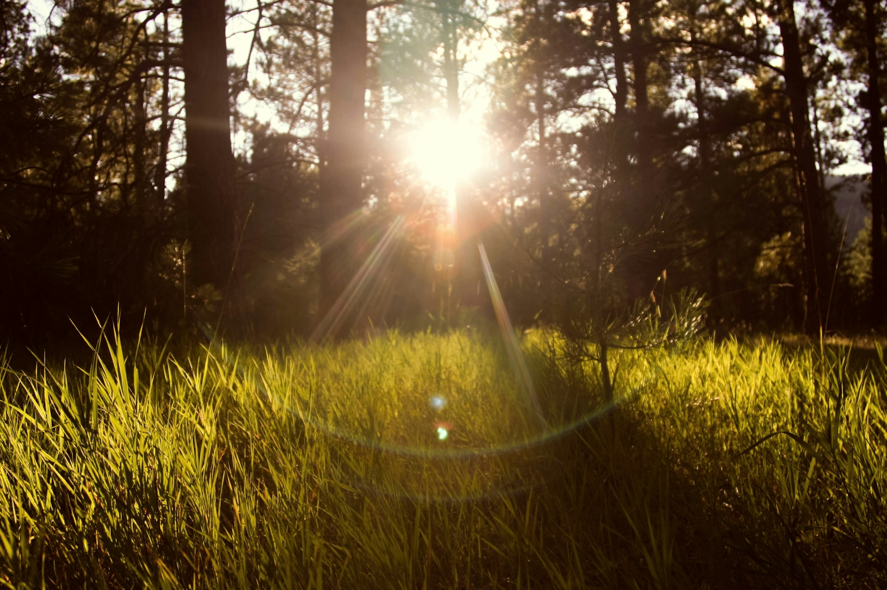
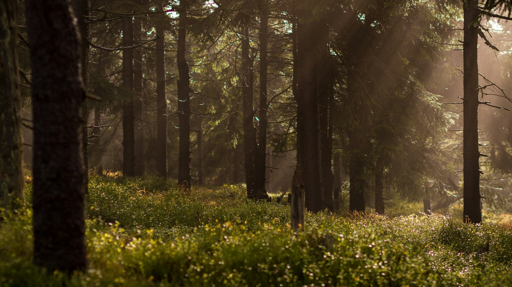
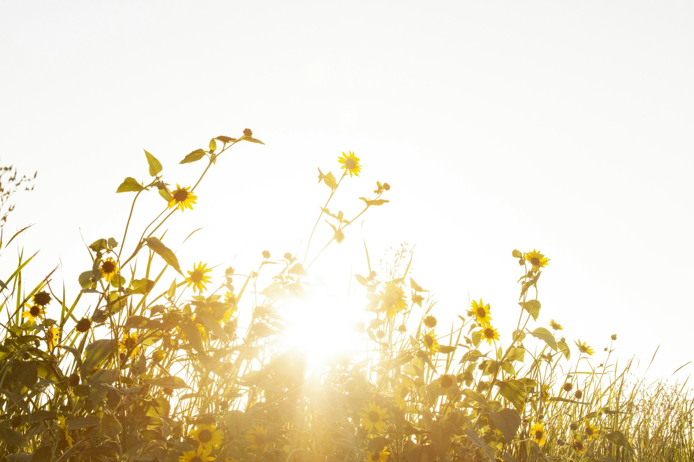

<!-- slide-id: 6b60e770-6fd5-4cb3-82a0-c8ef727400a1 -->

<!-- _header: "" -->
<!-- _paginate: false -->

# A Luz que Cura

O Primeiro dos 8 Remédios Naturais

---

<!-- slide-id: ca545253-57d9-4757-98ec-0551695f86ca -->

<!-- _header: "" -->

> "E disse Deus: Haja luz. E houve luz." — Gênesis 1:3

> "Mas para vós, os que temeis o Meu nome, nascerá o Sol da Justiça, trazendo cura nas Suas asas." — Malaquias 4:2

---

<!-- slide-id: 089ae850-5560-4999-8e45-184aac7f3298 -->

## A Luz na Criação

- Deus é Luz (1 João 1:5)
- A luz foi a **primeira** obra da criação (Gn 1:3)
- No quarto dia, Deus criou o sol, a lua e as estrelas (Gn 1:14-18)
- O sol não é apenas fonte física — aponta para o Criador, a Fonte de toda vida

---

<!-- slide-id: a6553552-e1d2-4019-afed-c99fcc6d6024 -->

## Sol da Justiça

- Malaquias 4:2 profetiza Cristo como o "Sol da Justiça"
- Jesus declarou: "Eu sou a Luz do mundo" (João 8:12)
- "Nele estava a vida, e a vida era a luz dos homens" (João 1:4)
- **Luz física** aponta para a **Luz espiritual**
- Não podemos separar o Criador da criação — o Sol físico reflete o Sol da Justiça

---

<!-- slide-id: aba7b0a9-a88f-415e-ad16-a48db3c1a9d6 -->

## Os Benefícios da Luz Solar

- Estimula a produção de **Vitamina D** — essencial para ossos e imunidade
- Regula o **ciclo circadiano** — melhora o sono
- Aumenta a **serotonina** — combate a depressão e ansiedade
- Reduz a **pressão arterial**
- Fortalece o **sistema imunológico**
- A luz solar cura! Tanto o corpo quanto a alma

---

<!-- slide-id: c7d9cc66-a980-496d-ae89-da53e43d271f -->

## A Luz e a Saúde Integral

> "A natureza é o médico de Deus. O ar puro, a radiosa luz solar, as flores e árvores, os pomares e vinhas e o exercício ao ar livre nessa atmosfera são salutares e vivificantes."
> — Ellen G. White, *A Ciência do Bom Viver*, p. 264
>
> [Fonte: egwwritings.org](https://ellenwhite.cpb.com.br/livro/index/31/261/270/em-contato-com-a-natureza)

- **30 minutos** de exposição diária (início da manhã / final da tarde)
- Evitar horários de pico (10h-16h)
- Aliar luz solar com **exercício ao ar livre**
- A natureza é a "farmácia de Deus"

---

<!-- slide-id: 5ecca446-1938-47c2-a097-061a8927e053 -->

## Luz vs. Trevas — O Grande Conflito

- O pecado é trevas; Cristo é a Luz (João 3:19-21)
- Satanás é descrito como "príncipe das trevas" (Efésios 6:12)
- A luz expõe, cura, revela a verdade
- "Andai enquanto tendes a luz, para que as trevas não vos surpreendam" (João 12:35)
- **A luz solar não é apenas física** — faz parte do plano divino de restauração

---

<!-- slide-id: 896a8159-2b11-4e9a-bccb-fea7e7494f2b -->

## Aplicação Prática

- Comece o dia com **oração e luz solar**
- Caminhe ao ar livre pela manhã — exercício + luz
- Abra as janelas — deixe a luz entrar em sua casa
- Lembre-se: cuidar do corpo é **ato de adoração** (1 Co 6:19-20)
- Busque a Cristo, a **Luz verdadeira**, todos os dias

---

<!-- slide-id: a766b5a4-90c0-4319-88f2-f514c3015bc3 -->

## Conclusão

- O Sol físico nos aponta para o **Sol da Justiça**
- Jesus é a fonte de **toda cura** — física, mental e espiritual
- Ele nos chama a viver na **luz**, não nas trevas
- "Já é hora de despertardes do sono... a noite é passada, e o dia é chegado" (Rm 13:11-12)

> **Em breve, na Nova Jerusalém, "a cidade não precisa do sol, nem da lua, para lhe darem luz, pois a glória de Deus a iluminou" (Ap 21:23).**

### Até lá, sejamos filhos da luz!